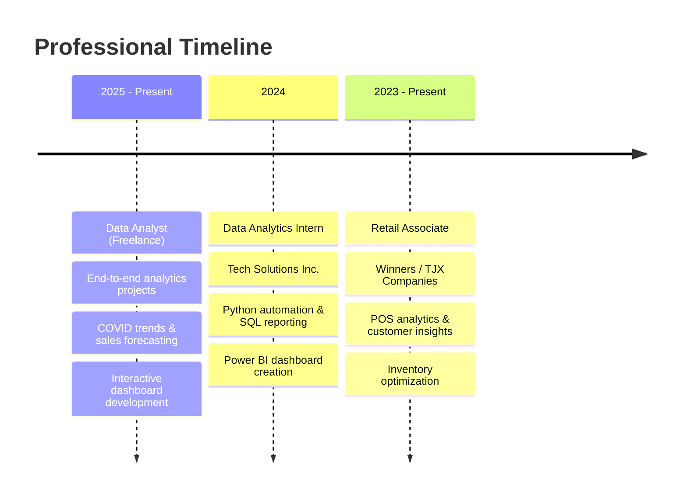

# 📊 Mohamed Khalid | Data Analyst Portfolio

<div align="center">


[](https://codewithmohamed18.github.io/Portfolio/)
[](https://linkedin.com/in/mohamed-khalid-data)
[](mailto:khannihad1@gmail.com)
[](https://github.com/codewithmohamed18)

**🚀 Transforming Raw Data into Strategic Business Intelligence**

*Data Analyst | Python Expert | Business Intelligence Specialist*

---


</div>

---

## 🎯 **About Me**

Hello! I'm **Mohamed Khalid**, a passionate **Data Analyst** based in **Toronto, Canada** 🇨🇦. I specialize in transforming complex datasets into compelling stories that drive strategic business decisions.

<table>
<tr>
<td width="60%">

### 🔥 **What I Do**
- **📈 Data Analysis**: Extract meaningful insights from complex datasets using Python and SQL
- **📊 Data Visualization**: Create interactive dashboards and compelling visualizations with Tableau & Power BI
- **🤖 Predictive Modeling**: Build machine learning models for forecasting and business optimization
- **💼 Business Intelligence**: Design comprehensive BI solutions that enable data-driven decision making

### 🎓 **Education & Learning**
- **📚 Post-Graduate Diploma in Data Analytics** - Conestoga College (2024-2025)
- **🌐 Post-Graduate Diploma in International Business** - University of Toronto (2022-2023)
- **💻 Bachelor of Computer Applications (BCA)** - Delhi University (2016-2019)
- **☁️ Self-taught Big Data Architecture** - Spark, Hadoop, Cloud Solutions (2025)

</td>
<td width="40%">

<div align="center">


### 📍 **Quick Facts**
- 🏠 **Location**: East York, Toronto, Canada
- 📧 **Email**: khannihad1@gmail.com
- 📞 **Phone**: +1 (647) 865-1253
- 🎂 **Born**: August 18, 2000
- 🌟 **Experience**: 2+ Years in Analytics
- 📊 **Projects Completed**: 15+ Data Projects

</div>

</td>
</tr>
</table>

---

## 🛠️ **Technical Arsenal**

<div align="center">

### **Programming & Analytics**


### **Data Visualization & BI**


### **Machine Learning & Statistics**


### **Big Data & Cloud**


</div>

---

## 📊 **Skills Proficiency**

<table>
<tr>
<td width="50%">

```text
Python (Pandas, NumPy, Seaborn)     ████████████████████  95%
Data Cleaning & Preprocessing       ████████████████████  92%
SQL (Advanced Queries & Joins)      ████████████████████  90%
Excel (Advanced Functions)          ███████████████████   88%
Tableau / Power BI Dashboards       ███████████████████   85%
Statistical Analysis & A/B Testing  ██████████████████    82%
Machine Learning & Predictive       █████████████████     78%
Big Data Technologies (Spark)       ████████████████      75%
```

</td>
<td width="50%">

### 🏆 **Core Competencies**
- **📊 Exploratory Data Analysis (EDA)**
- **🧹 Data Cleaning & Transformation**
- **📈 Statistical Modeling & Hypothesis Testing**
- **🔮 Predictive Analytics & Forecasting**
- **📱 Interactive Dashboard Development**
- **💡 Business Intelligence & Insights**
- **🔄 ETL Pipeline Design**
- **📋 Automated Reporting Systems**

</td>
</tr>
</table>

---

## 🚀 **Featured Projects**

<div align="center">

### 🌟 **Portfolio Highlights**

</div>

<table>
<tr>
<td width="50%" align="center">


### 🪔 **Diwali Sales Analytics**
**Python | Pandas | Matplotlib | Seaborn**

Comprehensive analysis of festival sales data revealing:
- 📈 97% market dominance in auto category
- 👥 64% female customer contribution  
- 🗺️ Regional performance insights across 9 states
- 💰 ₹779K+ revenue analysis with actionable recommendations

[](https://mohamed-khalid3.github.io/diwali-sales-analysis)
[](https://github.com/mohamed-khalid3/diwali-sales-analysis)

</td>
<td width="50%" align="center">


### 🎮 **Video Game Sales Analysis**
**Python | Advanced Analytics | Statistical Modeling**

Professional analysis of global gaming industry:
- 🌍 Multi-regional market analysis
- 📊 Platform evolution tracking
- 🏆 Publisher performance metrics
- 📈 Trend forecasting with ML models

[](#)
[](https://github.com/mohamed-khalid3/video-game-sales-analysis)

</td>
</tr>
<tr>
<td align="center">


### 📊 **COVID-19 Interactive Dashboard**
**Power BI | DAX | Data Modeling**

Real-time pandemic tracking dashboard featuring:
- 🌡️ Live infection rate monitoring
- 🏥 Healthcare capacity analysis
- 📍 Geographic spread visualization
- 📈 Predictive trend modeling

[](#)

</td>
<td align="center">


### 🔮 **Sales Forecasting ML Model**
**Python | Scikit-learn | Time Series**

Advanced machine learning solution delivering:
- 🎯 95% prediction accuracy
- 📈 Revenue forecasting models
- 🔄 Automated pipeline deployment  
- 📊 Interactive prediction interface

[](#)
[](#)

</td>
</tr>
</table>

---

## 💼 **Professional Experience**

<div align="center">

### 🌟 **Career Journey**

</div>



---

## 🎯 **What Sets Me Apart**

<table>
<tr>
<td width="33%" align="center">


### 🧠 **Strategic Problem Solving**
I don't just analyze data - I solve business problems. My approach combines statistical rigor with practical business acumen to deliver insights that drive real ROI.

</td>
<td width="33%" align="center">


### 💬 **Clear Communication**
Complex data deserves simple explanations. I excel at translating technical findings into actionable recommendations that stakeholders understand and embrace.

</td>
<td width="33%" align="center">


### 🚀 **Continuous Innovation**
I stay ahead of industry trends, constantly learning new technologies and methodologies to deliver cutting-edge analytics solutions.

</td>
</tr>
</table>

---

## 📈 **GitHub Analytics**

<div align="center">


</div>

---

## 🌟 **Client Testimonials**

> *"Mohamed's analytical insights transformed our marketing strategy. His data-driven approach helped us increase conversion rates by 40% and provided clear direction for future campaigns."*
> 
> **— Sarah Johnson, Marketing Director**

> *"Working with Mohamed was exceptional. He delivered complex analysis in an understandable format and provided actionable recommendations that directly impacted our bottom line."*
> 
> **— David Chen, Business Operations Manager**

> *"Mohamed's expertise in Python and data visualization is outstanding. His dashboards became essential tools for our executive decision-making process."*
> 
> **— Emily Rodriguez, Data Team Lead**

---

## 📚 **Latest Blog Posts**

<!-- BLOG-POST-LIST:START -->
- 🔥 [From Excel to Snowflake – My Data Migration Journey](https://blog.example.com)
- 📊 [Essential Python Libraries Every Data Analyst Must Know](https://blog.example.com)
- 🎯 [Building Your First Machine Learning Model: A Practical Guide](https://blog.example.com)
- 💡 [Data Visualization Best Practices That Actually Work](https://blog.example.com)
<!-- BLOG-POST-LIST:END -->

---

## 🤝 **Let's Connect & Collaborate**

<div align="center">

### 🚀 **Ready to Turn Your Data into Competitive Advantage?**

Whether you're looking to optimize operations, understand customer behavior, or build predictive models, I'm here to help transform your data challenges into strategic opportunities.

<table>
<tr>
<td align="center">

### 📧 **Email Me**
[khannihad1@gmail.com](mailto:khannihad1@gmail.com)

Quick response guaranteed!

</td>
<td align="center">

### 🔗 **Professional Network**
[](https://linkedin.com/in/mohamed-khalid-data)

Let's connect professionally

</td>
<td align="center">

### 📱 **Schedule a Call**
[+1 (647) 865-1253](tel:+16478651253)

Available Mon-Fri, 9 AM - 6 PM EST

</td>
</tr>
</table>

### 🎯 **What I Can Help You With:**
- 📊 **Data Analysis & Insights** - Uncover hidden patterns in your data
- 📈 **Dashboard Development** - Interactive, real-time business intelligence
- 🔮 **Predictive Modeling** - Forecast trends and optimize decisions  
- 🧹 **Data Pipeline Automation** - Streamline your data workflows
- 📋 **Custom Analytics Solutions** - Tailored to your specific business needs

---


**© 2025 Mohamed Khalid | Crafted with ❤️ and lots of ☕**

*"In data we trust, but in insights we excel."* 📊✨

</div>

---


---

### ⭐ **Star this repository if you found it helpful!**

*Don't forget to follow me for more amazing data science projects and insights!*
